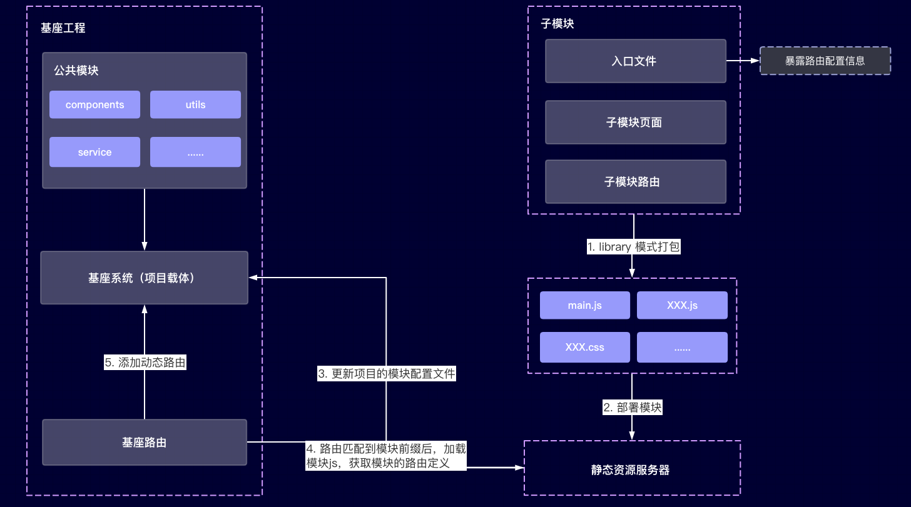

# 基于 vue 的可插拔架构设计

## 什么是可插拔架构
简单来说，可插拔架构就好比是一个插排，可以连接一个及以上的插头，插头插上或者拔下都不影响插排的正常使用，插上去某个插头连接的电器可用，拔下来，该电器停用。而在我们前端体系中，一个个带插头的电器可以看成是项目上的各个模块，插排就是我们的项目主体（或者叫基座工程），通过配置文件来定义需要安装在基座上的模块信息，子模块的插拔不会影响基座工程的正常运行，从而达到前端模块的热部署（热插拔）。

这也是微前端解决方案的一种，关于微前端的概念，应用场景，使用意义等在这里就不多说了，感兴趣的童鞋可以自行google，下面主要介绍下统一技术栈下，大型前端项目如何做模块的可插拔。

本文思路最早来自于[微前端在美团外卖的实践](https://tech.meituan.com/2020/02/27/meituan-waimai-micro-frontends-practice.html)，在研究过程中，发现已有大佬留下了坚实的肩膀给我，本文代码来源于[基于 Vue 技术栈的微前端方案实践](https://juejin.im/post/6844904079441805326#heading-4)。

## 方案介绍
整体方案如下图所示：


1. 基座工程
   
基座工程可以理解成是整个项目的主体，承载了我们所有的模块，主要是由公共模块，路由，基座框架构成，公共模块就不多说了，整个项目公用的的utils，service，components等都定义在这，路由模块的作用就是在匹配到配置的子模块路径前缀时，在本地缓存中查找是否已经加载对应模块，未加载则通过 systemjs 加载对应模块，并将模块路由通过 addRoutes 动态注册到基座项目中，而整个基座项目可以在入口函数中，通过接口获取我们模块定义的配置文件，从而实现模块的热插拔，当然，作为一个完成的项目，你也可以将一些不需要插拔的模块功能直接实现在基座工程中。

```js
// 动态加载模块路由
router.beforeEach(async (to, from, next) => {
  const [, , module] = to.path.split('/');

  if (!modules[module]) {
    return next();
  }

  if (cachedModules.has(module)) {
    return next();
  }

  const { default: application } = await window.System.import(modules[module]);

  if (application && application.routes && application.routes.length) {
    const routes = router.options.routes || [];
    const homeRoutes = routes.find(r => r.name === 'Home');
    if (homeRoutes) {
      !homeRoutes.children && (homeRoutes.children = []);
      if (!homeRoutes.children.length) {
        const route = application.routes[0];
        homeRoutes.children.push({
          path: '',
          redirect: route.name
        });
      }
      application.routes.forEach((route: RouteConfig) => homeRoutes.children?.push(route));
      router.addRoutes([homeRoutes]); // 动态添加子项目的 routes
    }
  }

  application && application.beforeEach && router.beforeEach((to, from, next) => {
    if (module === to.path.split('/')[1]) {
      application.beforeEach(to, from, next);
    } else {
      next();
    }
  });

  application && application.init && await application.init({}); // 子项目初始化

  cachedModules.add(module);

  next(to.path);
});
```

2. 子模块

子模块这里和一些主流的微前端框架有一些出入，我们这里的子模块是一个单独的项目，但是又不算是一个完整的项目，他依赖于基座工程中的公用模块和方法定义，自身不需要也不支持单独部署，他的一个核心点就是对外暴露自身的路由配置，如果需要的话，在基座工程的 store 中，通过 registerModule 注册自己的 store。

子模块开发完成后，我们需要将他按照 vue-cli 3 的 library 模式进行打包，方便后续在基座工程中的引入，同时，我们将打包后的项目部署到静态资源服务器上，做完这些之后，我们只需要再将项目的模块配置文件做一些更改即可。

```js
// 动态注册 store
if (Vue.__GLOBAL_POOL__.store) {
  const keys = Object.keys(modules);
  keys.forEach(key => {
    Vue.__GLOBAL_POOL__.store.registerModule(`${VUE_APP_NAME}/${key}`, modules[key]);
  });
}
```

## 总结
1. 该架构只适用于技术栈统一的项目，如果技术栈不统一，那还是老老实实用 qiankun 吧，就我个人对微前端的理解已经一些主流框架的调研，qiankun 还是挺好用的。
2. 目前方案设计中暂时没有对全局变量冲突，样式冲突等做处理，就我自己而言，样式冲突可以用规范以及 scoped 简单处理，全局变量的话，能不用就不要用了，既然没处理，那就不用了呗，hhh。。。
3. 采用该架构，对原有项目的侵入性较小，保证各模块之间的高内聚低耦合
4. 项目模块开发支持热插拔，子模块的功能迭代不需要对整个项目做打包上线，节约了大量的打包等待时间，提高了开发体验，加快了上线的速度
5. 一些定制化的模块需求，完全可以根据极少的一些规范独立开发，在不影响整体项目的情况下做到模块的可插拔，对一些对外的商业化项目来说，可用性极强
6. 和 qiankun 等微前端框架对比，我觉得这种模块的可插拔的应用场景在于模块的独立，而不是项目的整合，如果把模块做成一个完成的项目部署，然后再去用微前端，个人来说，没必要，有点太重了
7. 以上总结纯属个人瞎BB，大家看看就好

## 最后
好吧，我知道自己的这篇文章很水，代码也是借鉴的，但是在这个方案的可行性上自己确实做了大量的研究和工作，只是不知道该怎么表达，有兴趣的朋友可以找我私下交流，虽然我不会写文章，但是我 boast 很强，hhhh。

最后，按照惯例贴一下该项目的 git 仓库地址：https://github.com/minteliuwm/vue-pluggable-frame 这里我把基座工程和子模块放在一个项目中，然后贴了一份自己本地测试时的 nginx
配置，有兴趣的童鞋可以了解一下，用不用什么的都无所谓，重点是走过路过 star 给一个呗。

最后的最后，如果对该种方案有兴趣，或者有什么问题建议啥的，欢迎留言交流，